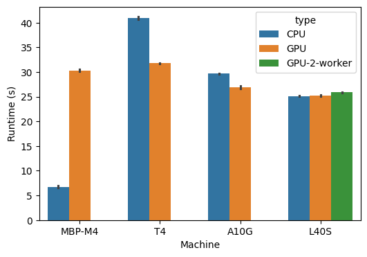
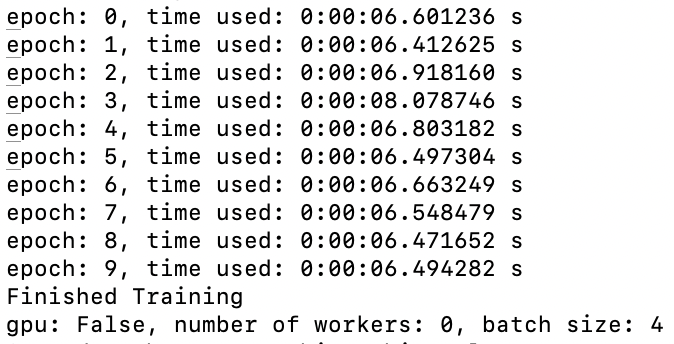
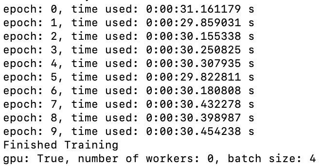
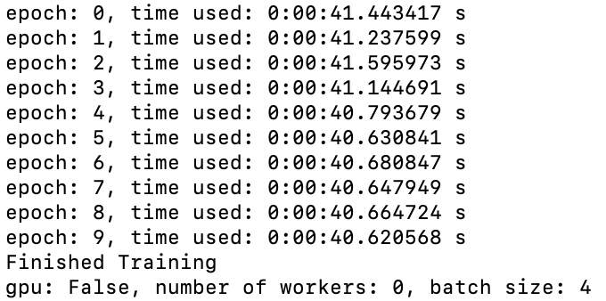
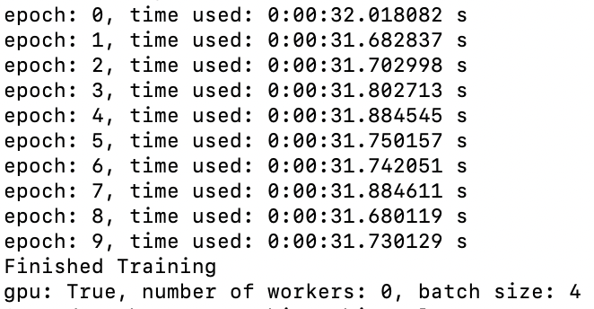
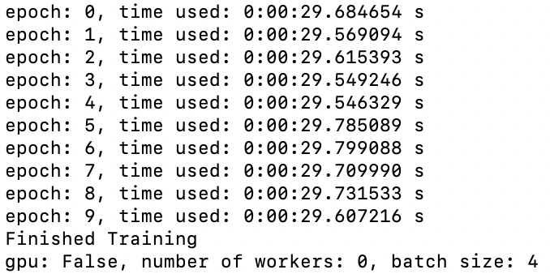
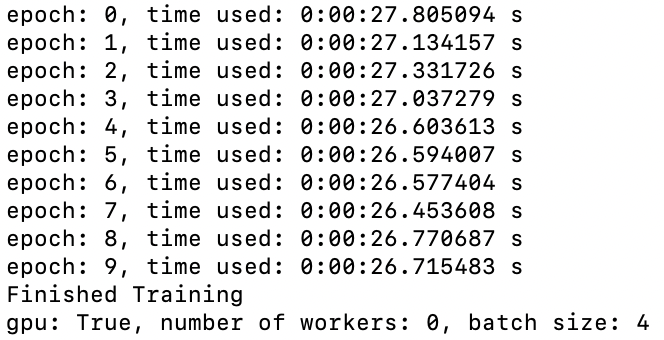
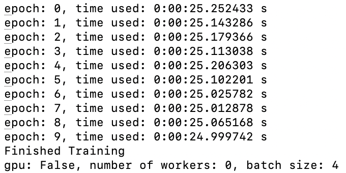
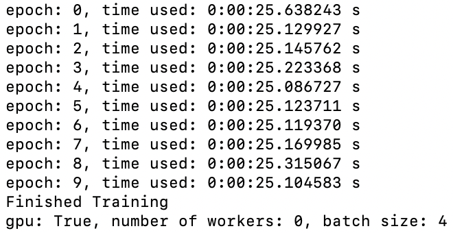

# speed_compare
This repo compares the runtime of a simple CNN model ([Link](https://pytorch.org/tutorials/beginner/blitz/cifar10_tutorial.html)) on different machines. (MacBook-M4, Linux-Nvidia, etc). The CNN model was ran with 10 epochs and a batch size of 4. Surprisingly, Macbook Pro M4 cpu runtime is way less than the rest of configurations. 

Types of machines or GPUs used in this test include: 
    
    1. MacBook Pro M4
        * 10-Core CPU
        * 10-Core GPU
        * 16GB Unified Memory
    2. Tesla T4 GPU
        * 8 CPU
        * 16G GPU RAM 
    3. A10G GPU
        * 32 CPU 
        * 24G GPU RAM
    4. L40S GPU 
        * 16 CPU 
        * 48G GPU RAM 

notes: 

1. add description of python version on each machine
    python version 
    pytorch verion 

## Bar plot 

## M4 CPU

## M4 GPU 

## T4 only using CPU

## T4 GPU 

## A10G only using CPU

## A10G GPU 

## L40S only using CPU

## L40S GPU 
